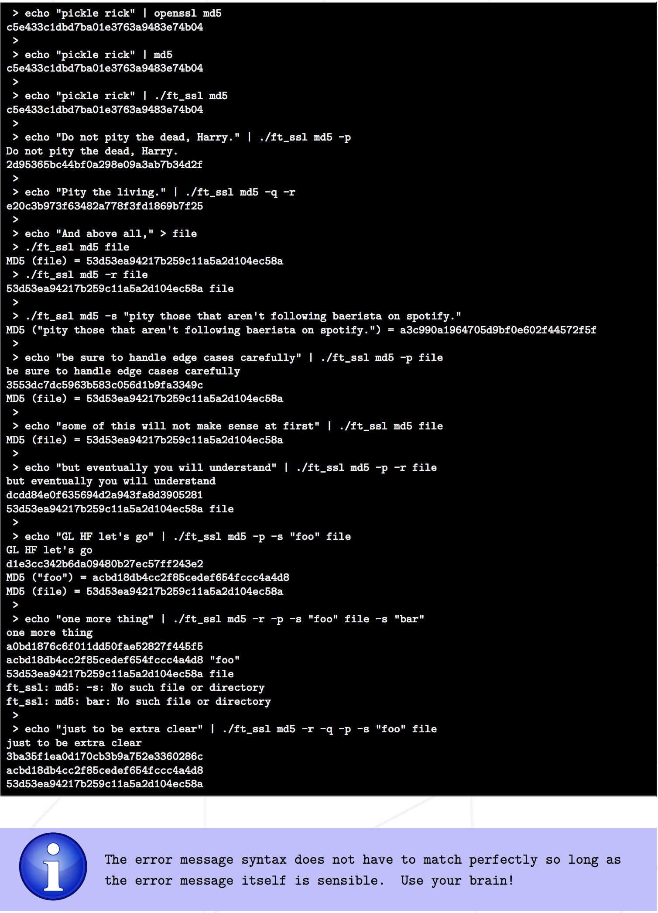
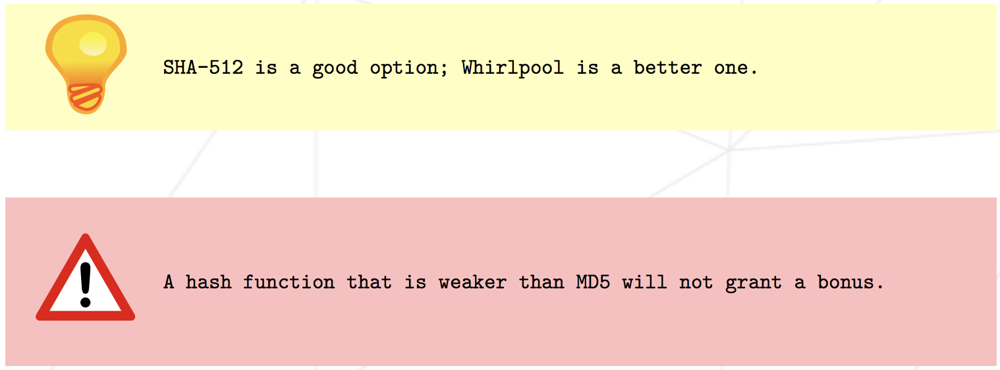

# ft_ssl_md5

### Table Of Contents
* [Introduction](#introduction)
* [Objective](#objective)
* [Instructions](#instructions)
* [Dependencies](#dependencies)
* [Installation](#installation)
* [Usage](#usage)
* [Testing](#testing) 
* [Future](#future)
* [Mechanics](#mechanics)
* [Credits](#credits)
* [Disclaimer](#disclaimer)
* [Keep In Touch](#keep-in-touch)

## Introduction  

#### About This Project
This project will focus specifically on cryptographic hashing algorithms to solidify the understanding of bitwise operations, integer overflow, and one-way functions. A subplot to this project is to emphasize writing clean code that can be efficiently extended.
#### About Me
Developer, Designer Be creative!! Currently Studying [@42SiliconValley][42]

#### About 42  
[42][42] is a free, non profit, project-based, peer-to-peer learning coding school. It originated in France and now has over 20 campuses all over the world. More information can be found [here][42] 

## Objective  
Learn the crpytographic hasing algorithms
Solidify understanding of bitwise operations, integer overflow, and one-way functions
Emphasize writing clean code that can be efficiently extended
## Instructions
Make sure you have the needed [dependencies](#dependencies) before proceeding.
For instructions and/or greater detail refer to the project [pdf][pdf]
- [ ] The executable file must be named ft_ssl
- [ ] Must submit a Makefile which contain the usual rules and compile the project as necessary
- [ ] Project must be written in accordance with the Norm
- [ ] Handle usual errors(Segfault, bus error, double free) and openssl related error carefully
- [ ] Submit an author file at the root of your repository
- [ ] Allowed the flowing functions: open, close, read, write, malloc, free
- [ ] ALlowed to use other functions as long as their use is justified
## Mandatory part
- [ ] Create a program named ft_ssl that will recreate part of the OpenSSL functionality
- Create the md5 command for ft_ssl program which include the following flags
- [ ] -p, echo STDIN to STDOUT and append the checksum to STDOUT
- [ ] -q, quiet mode
- [ ] -r, reverse the format of the output
- [ ] -s, print the sum of the given string
- [ ] Emulate the behavior of the md5 executable
- [ ] If flags are not provided, be prepared to read/write from.to the console

- Create the sha256 command for ft_ssl program which include the following flags:
- [ ] -p, echo STDIN to STDOUT and append the checksum to STDOUT
- [ ] -q, quiet mode
- [ ] -r, reverse the format of the output
- [ ] -s, print the sum of the given string
- [ ] The behavior should be exactly the same as the command above, witht the only difference being the hash algorithm in question

## Bonus part
-- There are several bonuses that can be earned for this project
- [ ] Parse commands from STDIN the same way that OpenSSL does
- Include additional hashing algorithms in ft_Ssl executable
- The bonus algorithms are expected to have the same flag functionality as above

## Dependencies  
* A C language compiler most common would be GCC or Clang.
* These were written to run on Unix based systems, it would likely work on a windows machine too but is currently untested. 

## Installation 
git clone https://github.com/kosehy/ft_ssl_md5.git
## Usage  

## Testing  

## Future 

## Mechanics  

## Credits  

Some frameworks and libraries that were helpful with testing.   

## Disclaimer

This project was done for learning purposes only.

### Warning For 42 Students

This is not kept up to date and I cannot guarantee that it will work on your future machines. You are welcome to use and learn from this as you want, but do not implement code that you do not understand. Copying is not the way. 

## Keep in Touch

You can find me on:
[Github][kosehy]
Enjoy!

[42]: http://42.us.org "42 USA"
[pdf]: https://github.com/kosehy/ft_ssl_md5/blob/master/ft_ssl_md5.en.pdf
[kosehy]: https://github.com/kosehy
